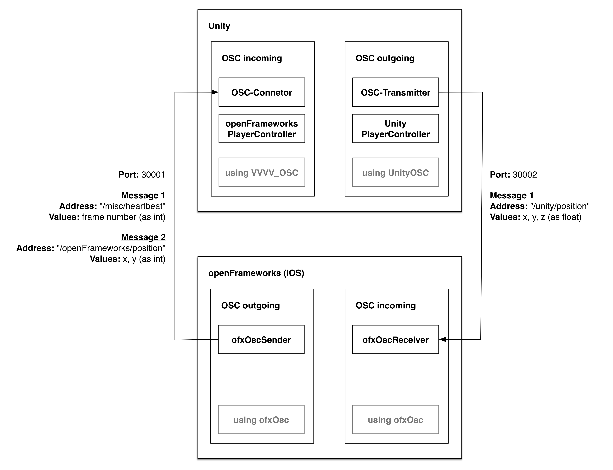

# Unity - iOS (openFrameworks) via OSC

This is an example project demonstrating bi-directional communication between a Unity application to a iOS application (built with openFrameworks) using the [OSC](http://opensoundcontrol.org) (Open Sound Control) network protocol.

The project enables the user to manipulate the position of two game objects (Sphere in Unity (green), Circle in openFrameworks (red)). The updated position of the game object in Unity is sent via OSC to the iOS openFrameworks application and vice versa.

[ofxOsc](http://openframeworks.cc/documentation/ofxOsc/) was used to send and receive OSC messages in openFrameworks.
[UnityOSC](https://github.com/jorgegarcia/UnityOSC) by Jorge Garcia was used in Unity to send OSC messages, while  [VVVUnityOSC](https://github.com/frankiezafe/VVVVUnityOSC) by frankiezafe was used to specifically receive OSC messages, which originated from an openFrameworks client (feat. bundle management), in Unity.

## Dependencies
This example has been built using the following specifications:

* OS X 10.11.4
* Xcode 7.3
* [openFrameworks](https://github.com/openframeworks/openFrameworks/) 0.9.3 (iOS release)
* [ofxOsc](http://openframeworks.cc/documentation/ofxOsc/)
* Unity 5.3.1f1 Personal
* [UnityOSC](https://github.com/jorgegarcia/UnityOSC) v.1.2 by Jorge Garcia
* [VVVUnityOSC](https://github.com/frankiezafe/VVVVUnityOSC) by frankiezafe
* [OSC (Open Sound Control)](http://opensoundcontrol.org)

*Note:* Generally, the openFrameworks and Unity source code should work also within their Windows counterparts. Please check out the above stated dependencies for troubleshooting.

## Architecture

## Setup instructions
### openFrameworks
1. Place the contents of the `ios_of` folder into your `of_v0.9.3_ios_release/apps/myApps/` folder, or alternatively link the openFrameworks library accordingly within the iOS project settings. (*Xcode only*)
2. Check the **Bundle Identifier** and **Team** properties in the iOS project settings. (*Xcode only*)
3. In `src/ofApp.h`, change the `OSC_OUT_HOST` IP address to be the IP address of the machine you run the Unity application on.
4. In the `src/ofApp.h`, change the `OSC_OUT_PORT` and `OSC_INC_PORT` in case you want to use different ports. (*optional*)

### Unity
1. Load the *Default.unity* scene located in the `Assets/_Scenes` folder.
2. In `Assets/ThirdParty/OSC/OSCHandler.cs`, change the `CLIENT_IP_ADDRESS` IP address to be the IP address of the device you run the openFrameworks application on.
3. In `Assets/ThirdParty/OSC/OSCHandler.cs`, change the `CLIENT_PORT` in case you want to use a different port for outgoing OSC messages. (*optional*)
3. In `Assets/_Scripts/OSCConnector.cs`, change the `OSC_PORT` in case you want to use a different port for incoming OSC messages. (*optional*)

### Running the applications
1. Start the openFrameworks application.
2. Once 1. is running, start the Unity application.
3. Touch input on iOS moves the red circle/sphere. Selecting the `Unity-Player-Controller` in the Unity editor's **SceneView** and manipulating its position will move and update the green sphere/circle.

## Screenshots

## License
MIT License, see [LICENSE.md](LICENSE.md)
